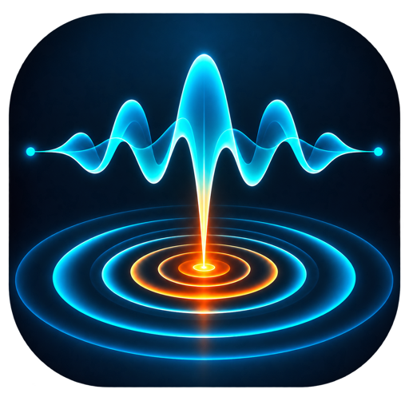

<div align="center">
  

  # SonArcan

  **Dive into the music.**

  A focused, local-first desktop workspace to learn, analyze, isolate, and rehearse music.

  [](https://support.apple.com/macos)
  
  [](LICENSE)
  [](https://www.paypal.com/paypalme/z5omes)
</div>

> [!IMPORTANT]
> SonArcan currently runs **only on Apple Silicon Macs** (`M1`, `M2`, `M3`, `M4` and later) with **macOS 14 or newer**. Intel Macs, Windows, and Linux are not supported at this time.

SonArcan is made for musicians who want the useful parts of an audio workstation without the weight of a full DAW. Import a setlist, understand the music, isolate parts, build loops, and practice—all while keeping projects portable and data on your Mac.

## ✨ Highlights

- Import WAV, MP3, FLAC, local files, or YouTube sources into portable `.sac` projects.
- Play, seek, change gain, and create seamless A/B loops through a dedicated Rust audio engine.
- Slow down or speed up from 50–200% independently of pitch, with ±12 semitones and fine cent correction.
- Detect BPM, beats, downbeats, and timed chords locally, with detected timelines and source-aware disposable caches.
- Separate six stems locally with HTDemucs 6s and Apple MLX, then mix or export them.
- Practice with a progressive loop trainer, synchronized metronome, waveform, spectrum, and stereo meter.
- Keep per-track practice settings, recent projects, diagnostics, and a multilingual interface.

For planned work and known product directions, see the [roadmap](docs/ROADMAP.md).

## 🧰 Built with—and grateful for

SonArcan stands on an outstanding open-source audio and desktop ecosystem:

| Area | Tools and projects |
| --- | --- |
| Desktop & interface | [Rust](https://www.rust-lang.org/), [Tauri 2](https://tauri.app/), [Svelte 5](https://svelte.dev/), [TypeScript](https://www.typescriptlang.org/), [Vite](https://vite.dev/) |
| Real-time audio | [CPAL](https://github.com/RustAudio/cpal), [Symphonia](https://github.com/pdeljanov/Symphonia), [Signalsmith Stretch](https://signalsmith-audio.co.uk/code/stretch/), [RustFFT](https://github.com/ejmahler/RustFFT) |
| Source separation | [Apple MLX](https://github.com/ml-explore/mlx), [demucs-mlx](https://pypi.org/project/demucs-mlx/), [HTDemucs 6s](https://github.com/facebookresearch/demucs), [Python](https://www.python.org/) |
| Musical analysis | [LV-Chordia](https://github.com/openmirlab/lv-chordia), [Beat This!](https://github.com/CPJKU/beat_this), [PyTorch](https://pytorch.org/), [librosa](https://librosa.org/) |
| Import & media | [FFmpeg](https://ffmpeg.org/), [LAME](https://lame.sourceforge.io/), [yt-dlp](https://github.com/yt-dlp/yt-dlp) |
| Reproducible builds | [npm](https://www.npmjs.com/), [Cargo](https://doc.rust-lang.org/cargo/), [uv](https://docs.astral.sh/uv/), GitHub Actions |

A heartfelt thank-you to every maintainer, researcher, tester, and contributor behind these projects. Their work makes SonArcan possible. Licensing and attribution details are collected in [Third-party notices](THIRD_PARTY_NOTICES.md).

## 🚀 Run from source

### Requirements

- Apple Silicon Mac with macOS 14+
- Node.js 22+ and npm
- Stable Rust 1.78+ with Cargo
- `uv` exactly `0.9.26`
- FFmpeg for development
- [Tauri 2 prerequisites for macOS](https://v2.tauri.app/start/prerequisites/)

Install the native tools and pinned Python versions:

```bash
rustup toolchain install stable
brew install ffmpeg
curl -LsSf https://astral.sh/uv/0.9.26/install.sh | sh
uv python install 3.13.5
uv python install 3.12.12
```

Prepare a fresh checkout:

```bash
npm ci
npm run mlx:sync
npm run test:chords
npm run mlx:model
npm run quality
```

Start the complete desktop application:

```bash
npm run tauri dev
```

`npm run dev` starts only the frontend; playback, project management, analysis, and stems require Tauri and the Rust backend.

## 📦 Build for macOS

SonArcan releases bundle the pinned Python/MLX workers, analysis models, and ARM64 FFmpeg runtime. End users do not need to install Python, `uv`, FFmpeg, or model dependencies.

```bash
npm ci
npm run mlx:sync
npm run mlx:model
npm run mlx:runtime
npm run chords:runtime
npm run ffmpeg:runtime
npm run quality
npm run build:macos:dmg
```

The resulting Apple Silicon DMG is written under `src-tauri/target/aarch64-apple-darwin/release/bundle/dmg/`. GitHub release builds are ad-hoc signed so every embedded executable has a consistent code signature, but they are not notarized or identified by Apple. On first launch, users must explicitly allow SonArcan under **System Settings → Privacy & Security → Open Anyway**. The complete workflow and trust model are documented in the [release guide](docs/RELEASING.md).

## 🎼 Portable projects

A `.sac` project is an inspectable directory that macOS presents as a single SonArcan document:

```text
My-Band.sac/
├── project.json
├── Audio/
├── Stems/
├── Analysis/
├── Chords/
└── Cache/
```

The manifest stays human-readable. Original media and user-authored data are kept separate from disposable analysis and cache files.

## 📚 Documentation

- [Architecture](docs/ARCHITECTURE.md) · [Development](docs/DEVELOPMENT.md) · [Quality](docs/QUALITY.md)
- [Real-time audio](docs/AUDIO_ENGINE.md) · [Chord analysis](docs/CHORD_ANALYSIS.md) · [Stem separation](docs/STEM_SEPARATION.md)
- [Practice workflow](docs/PRACTICE_WORKFLOW.md) · [Project management](docs/PROJECT_MANAGEMENT.md) · [Waveforms](docs/WAVEFORM.md)
- [Contributing](CONTRIBUTING.md) · [Security](SECURITY.md) · [Roadmap](docs/ROADMAP.md) · [Release guide](docs/RELEASING.md)

## 🤝 Contributors

SonArcan grows through code, ideas, testing, musical feedback, and careful open-source work. Thank you—warmly—to everyone who has helped shape it.

Current repository contributors:

- [OrangeJuce82](https://github.com/OrangeJuce82) — creator and maintainer

Want to join the list? Read [CONTRIBUTING.md](CONTRIBUTING.md), open an issue, or submit a focused pull request. Every thoughtful contribution is welcome.

## ☕ Support SonArcan

If SonArcan helps your practice sessions and you would like to support its continued development, you can offer the project a coffee through PayPal:

<div align="center">
  <a href="https://www.paypal.com/paypalme/z5omes">
    
  </a>
</div>

Thank you for listening, testing, contributing, sharing, and supporting the project. 💙

## License

SonArcan is available under the [MIT License](LICENSE). Third-party components and models retain their own licenses; see [THIRD_PARTY_NOTICES.md](THIRD_PARTY_NOTICES.md).
